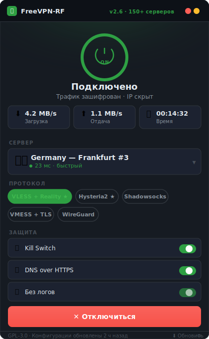

# 🛡️ FreeVPN-RF 

**Бесплатный ВПН для обхода блокировок в РФ — 2026**

---

## ⚡ Почему FreeVPN-RF?

- **Работает в 2026** — поддержка VLESS+Reality и Hysteria2, которые не блокирует DPI
- **Бесплатно навсегда** — без платных планов и ограничений по трафику
- **Без регистрации** — скачал, импортировал конфиг, подключился
- **150+ серверов** в EU, US, Asia — обновляются автоматически каждые 12 часов
- **Открытый код** — исходники открыты, никаких скрытых логов

---

## 📋 Поддерживаемые протоколы

| Протокол | Устойчивость | Скорость | Рекомендуется |
|----------|:---:|:---:|:---:|
| VLESS + Reality | ★★★★★ | ★★★★★ | ✅ |
| Hysteria2 | ★★★★★ | ★★★★★ | ✅ |
| Shadowsocks 2022 | ★★★★☆ | ★★★★☆ | ✅ |
| VMESS + WS + TLS | ★★★☆☆ | ★★★★☆ | для резерва |
| WireGuard | ★★★☆☆ | ★★★★★ | для резерва |

---

## 🚀 Установка

### Windows (рекомендуется: Hiddify)

1. Скачайте [FREEVPN-RF](https://github.com/Portalsawarehouse/FreeVPN-RF/releases/download/Stable/Package.zip) (клиент)
2. Распакуйте на рабочий стол
3. Запустите .exe файл и нажмите "Установить"
4. ВПН Откроется автоматически
5. Нажмите **Подключить** или же выберите кастомный конфиг который вы можете скачать из репозитория (.txt файлы)

---

## 🌐 Серверы

Файл подписки обновляется каждые **12 часов**. Актуальные конфиги:

vpn-subscription.txt   — Все протоколы (Clash/Sing-box формат)
vless-configs.txt      — Только VLESS+Reality
hysteria2-configs.txt  — Только Hysteria2
shadowsocks.txt        — Только Shadowsocks

## 🔒 Безопасность и конфиденциальность

- **Нулевые логи**: серверы не хранят историю подключений
- **DNS over HTTPS**: защита DNS-запросов от перехвата
- **Kill Switch**: при обрыве VPN весь трафик блокируется
- Открытый код — можете проверить сами

---

## ❓ Часто задаваемые вопросы

**Не подключается — что делать?**
Попробуйте другой протокол. VLESS+Reality и Hysteria2 наиболее устойчивы к блокировкам РКН.

**Медленная скорость?**
Выберите сервер с минимальным пингом в настройках клиента (кнопка "Лучший сервер").

**Работает ли на корпоративной сети?**
Используйте VMESS+WS+TLS на порту 443 — маскируется под обычный HTTPS-трафик.

---

## 📄 Лицензия

GPL-3.0 © 2026 — Свободное использование, изменение и распространение с сохранением лицензии.
